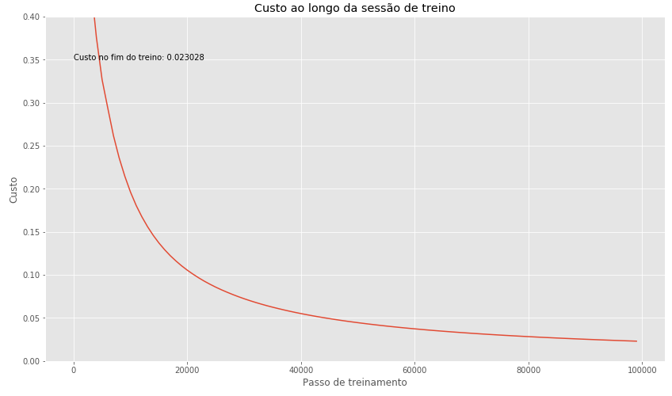
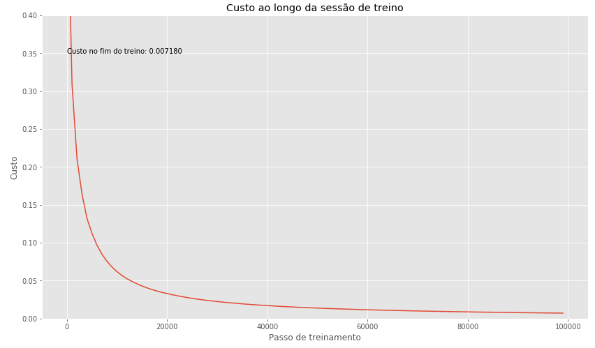

# Backpropagation em Numpy
Resolvendo XOR com Backpropagation em Numpy.

## Backpropagation
Backpropagation (retro-propagação) é usado em Neural Networks (Redes Neurais) para cálculo dos gradientes, propagando para trás o erro da previsão da rede. Após o cálculo dos gradientes, usa-se Gradient Descent (Gradiente Descendente) para ajustar os pesos da rede e minimizar o erro total.

## Momentum
Técnica para acelerar o processo de treinamento na direção correta. Para isso, adiciona uma fração do vetor update anterior ao vetor update atual. Normalmente, compara-se com uma bola descendo uma ladeira, ganhando velocidade naquela direção.

### Custo sem Momentum

### Custo com Momentum

